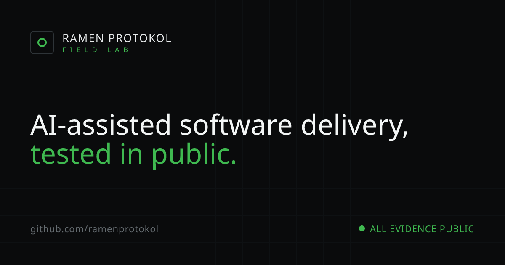

# Field Lab




> **AI-assisted software delivery, tested in public.** — Next.js 15 · TypeScript · static export.

The public engineering field laboratory of [Ramen Protokol](https://github.com/ramenprotokol) — a
mission-control dashboard for shipping real systems with AI and proving they work: experiments,
evaluations, validation frameworks, public repositories, and the evidence trail behind every claim.

It is not a startup site, a SaaS landing page, or a marketing site. It is a workbench you can read.

---

## Stack

- **Next.js 15** (App Router) — static-first, exported as a fully static site (`output: "export"`).
- **TypeScript** (strict).
- **Tailwind CSS** — design tokens lifted from the approved "Field Lab" design.
- **next/font** — self-hosted Space Grotesk, IBM Plex Sans, and IBM Plex Mono (no third-party font
  requests at runtime).
- No runtime backend. The build emits plain HTML/CSS/JS into `out/`.

## Sections

| # | Route | What it is |
|---|-------|------------|
| 00 | `/` | Home — mission briefing, station status, dashboard |
| 01 | `/signal-deck/` | A dated feed of experiments, findings, lessons, incidents |
| 02 | `/delivery-os/` | The 7-stage gated AI-assisted delivery lifecycle |
| 03 | `/hallucination-lab/` | Model scoreboard + logged hallucination findings |
| 04 | `/validation-playbooks/` | Repeatable validation procedures |
| 05 | `/build-logs/` | The public engineering journal |
| 06 | `/proof-wall/` | Every public repository, read as a case file |
| 07 | `/writing/` | Long-form essays on building with AI |
| 08 | `/contact/` | Public, async channels only |

## A note on the data

The brand rule is simple: **never present fabricated numbers as real.** This site ships with
illustrative content to demonstrate the layout, and every synthetic dataset is marked in the UI as
`DEMO DATA`, `SAMPLE`, or `PLANNED`. The only operational figure presented as real is the count of
public repositories. The two shipped repositories — [`hallucination-hunter`](https://github.com/ramenprotokol/hallucination-hunter)
and [`ai-delivery-engineering`](https://github.com/ramenprotokol/ai-delivery-engineering) — are real
and link to their source; concept repositories are labelled `PLANNED` and carry no invented metrics.

## Develop

```bash
npm install
npm run dev        # http://localhost:3000
```

## Quality gates

```bash
npm run typecheck  # tsc --noEmit
npm run lint       # next lint
npm run build      # production static export -> ./out
```

## Build & deploy (Cloudflare Pages)

```bash
npm run build      # outputs a static site to ./out
```

Cloudflare Pages settings:

- **Build command:** `npm run build`
- **Build output directory:** `out`
- **Framework preset:** Next.js (Static HTML Export) — or "None", since `out/` is plain static.

Security headers (CSP, anti-clickjacking, MIME-sniffing protection, referrer policy) are defined in
[`public/_headers`](public/_headers) and are copied into `out/` at build time, so Cloudflare applies
them automatically.

## Project structure

```
field-lab/
├── public/
│   └── _headers              # Cloudflare Pages security headers
├── src/
│   ├── app/                  # one folder per route + layout, robots, sitemap, 404, icon
│   ├── components/           # Shell (nav/topbar/drawer), ProjectCard, DemoBadge, …
│   └── lib/                  # site config, navigation, typed content, theme tokens
├── docs/og.png               # social-share / README hero image
├── next.config.mjs           # output: "export", trailingSlash
└── tailwind.config.ts        # design tokens
```

## License

[MIT](LICENSE) © 2026 Ramen Protokol — all evidence public.
